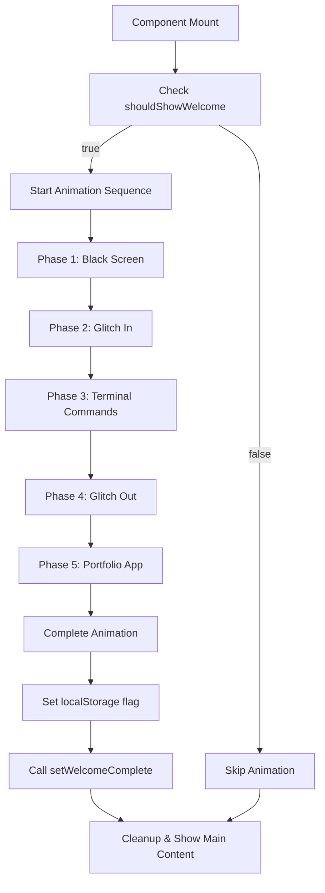

# Welcome Screen Animation System Documentation

## Overview

This documentation covers the comprehensive welcome screen animation system implemented for the Next.js portfolio site. The system provides a beautiful terminal-style hacker animation sequence that plays on first-time visits, creating an engaging entry point to the portfolio.

## Table of Contents

1. [Architecture Overview](#architecture-overview)
2. [Component Breakdown](#component-breakdown)
3. [Animation Phases](#animation-phases)
4. [Color Scheme & Styling](#color-scheme--styling)
5. [State Management](#state-management)
6. [Integration Guide](#integration-guide)
7. [Customization](#customization)
8. [Troubleshooting](#troubleshooting)

## Architecture Overview

The welcome screen system is built with the following core principles:
- **Render Control**: Prevents main content from rendering during welcome animation
- **SSR/Hydration Safe**: Handles client-side-only logic properly
- **Performance Optimized**: Uses efficient state management and animations
- **Accessible**: Includes proper escape mechanisms and overflow control

### Core Components

```
RenderController.tsx          - Context provider for render control
MainContentWrapper.tsx        - Wrapper that conditionally renders content
SimpleEnhancedWelcomeScreen.tsx - Main welcome screen with 5-phase animation
Terminal.tsx                  - macOS-style terminal window component
DebugControls.tsx            - Development testing controls
```

## Component Breakdown

### 1. RenderController (`src/components/RenderController.tsx`)

**Purpose**: Provides context for controlling when the main content should render.

**Key Features**:
- Manages `shouldShowWelcome` state based on localStorage
- Provides `setWelcomeComplete()` function to signal animation completion
- Handles client-side only logic to prevent SSR issues

**Usage**:
```tsx
const { shouldShowWelcome, setWelcomeComplete } = useRenderControl();
```

**State Logic**:
- First visit: `shouldShowWelcome = true`
- Subsequent visits: `shouldShowWelcome = false`
- Uses localStorage key: `'hasVisitedBefore'`

### 2. MainContentWrapper (`src/components/MainContentWrapper.tsx`)

**Purpose**: Conditionally renders children based on welcome screen state.

**Logic**:
```tsx
if (shouldShowWelcome) {
  return null; // Don't render main content
}
return <>{children}</>; // Render main content
```

### 3. SimpleEnhancedWelcomeScreen (`src/components/SimpleEnhancedWelcomeScreen.tsx`)

**Purpose**: Main welcome screen component with 5-phase terminal animation.

#### Animation Phases

| Phase | Duration | Description |
|-------|----------|-------------|
| `blackscreen` | 500ms | Pure black screen |
| `glitch-in` | 300ms | Green glitch effect with "INITIALIZING TERMINAL..." |
| `terminal` | ~7000ms | Terminal commands execution with syntax highlighting |
| `glitch-out` | 300ms | Glitch effect with "LAUNCHING PORTFOLIO..." |
| `portfolio-app` | 2500ms | Portfolio app window with welcome text |
| `complete` | - | Cleanup and transition to main site |

#### Terminal Commands Sequence

```bash
# Command 1: Navigate to workspace
$ cd ~/portfolio-workspace

# Command 2: List directory contents
$ ls -la
total 8
drwxr-xr-x  3 {firstName} staff   96 Jun  8 16:45 .
drwxr-xr-x  5 {firstName} staff  160 Jun  8 16:44 ..
-rw-r--r--  1 {firstName} staff 1024 Jun  8 16:45 portfolio.js
-rw-r--r--  1 {firstName} staff  512 Jun  8 16:45 package.json

# Command 3: Check package.json
$ cat package.json | grep -E '(name|version)'
  "name": "{firstName}-portfolio",
  "version": "2.0.0",

# Command 4: Initialize portfolio
$ sudo npm run initialize-portfolio
[sudo] password for {firstName}: ••••••••••
✓ Loading environment variables...
✓ Initializing React components...
✓ Setting up animations...
✓ Configuring theme system...

# Command 5: Start portfolio
$ python3 -c "import portfolio; portfolio.start()"
Success! Portfolio initialization completed.
The script is loading...
```

### 4. Terminal Component (`src/components/magicui/terminal.tsx`)

**Purpose**: Renders a macOS-style terminal window with authentic styling.

**Features**:
- macOS-style window controls (red, yellow, green buttons)
- Proper terminal header with Parrot OS branding
- Pure black background (#000000)
- Authentic terminal shadows and borders
- Monospace font stack

**Styling**:
```tsx
// Window styling
background: '#000000'
border: '2px solid #333333'
borderRadius: '12px'
boxShadow: multiple layers for depth

// Header styling
background: linear-gradient(180deg, #2a2a2a 0%, #1e1e1e 100%)
borderBottom: '1px solid #404040'

// Content area
background: '#000000'
fontFamily: "Fira Code", "JetBrains Mono", "Menlo", "Monaco", "Consolas"
```

## Color Scheme & Styling

### Parrot OS Terminal Color Scheme

The terminal uses an authentic Parrot OS color scheme with syntax-based highlighting:

#### Color Palette

| Element | Color | Hex Code | Usage |
|---------|-------|----------|-------|
| Command Prompt | Red | `#ef4444` | `$` symbol |
| Command Names | Green | `#4ade80` | `cd`, `ls`, `cat`, `sudo`, `python3` |
| Flags/Options | Cyan | `#67e8f9` | `-la`, `-E` |
| File Paths | Yellow | `#fde047` | Paths and file extensions |
| Quoted Strings | Orange | `#fdba74` | Quoted arguments |
| Pipes/Redirects | Purple | `#c084fc` | `|`, `>` operators |
| Success Messages | Green (Glow) | `#4ade80` | With text-shadow glow effect |
| Progress Indicators | Light Green | `#86efac` | `✓` checkmarks |
| JSON Keys | Cyan | `#22d3ee` | JSON property names |
| JSON Values | Amber | `#fbbf24` | JSON property values |
| JSON Syntax | Purple/Gray | `#a855f7`/`#6b7280` | `:`, `,` |
| Directory Permissions | Blue | `#60a5fa` | `drwxr-xr-x` |
| User/Group Info | Cyan | `#67e8f9` | Username in listings |
| Default Text | Light Gray | `#d1d5db` | General text |
| Subdued Text | Gray | `#9ca3af` | Timestamps, sizes |

#### Syntax Highlighting Logic

The `renderTerminalLine()` function applies colors based on content patterns:

```tsx
// Welcome message - Cyan with glow
if (line.startsWith('Welcome to')) {
  return <div style={{ color: '#22d3ee', textShadow: '0 0 5px #22d3ee' }}>

// Command lines - Red prompt + parsed command
if (line.startsWith('$ ')) {
  return <div>
    <span style={{ color: '#ef4444' }}>$</span>
    <span>{renderCommand(commandPart)}</span>

// Directory listings - Blue permissions
if (line.match(/^[drwx-]{10}/)) {
  return <div>{renderDirectoryListing(line)}</div>

// JSON output - Structured coloring
if (line.includes('"name"') || line.includes('"version"')) {
  return <div>{renderJsonLine(line)}</div>

// Success messages - Green with glow
if (line.includes('Success!')) {
  return <div style={{ color: '#4ade80', textShadow: '0 0 5px #4ade80' }}>

// Progress indicators - Green checkmarks
if (line.includes('✓')) {
  return <div>{renderProgressLine(line)}</div>
```

## State Management

### Animation State Flow



### Key State Variables

```tsx
// Animation control
const [currentPhase, setCurrentPhase] = useState<AnimationPhase>('blackscreen');
const [terminalContent, setTerminalContent] = useState<string[]>([]);
const [isPortfolioAnimating, setIsPortfolioAnimating] = useState(true);
const animationStarted = useRef(false);

// Mount safety
const [mounted, setMounted] = useState(false);

// Context state
const { shouldShowWelcome, setWelcomeComplete } = useRenderControl();
```

### State Safety Measures

1. **Mount Guard**: Prevents SSR issues
2. **Animation Guard**: Prevents multiple animation starts
3. **Phase Control**: Ensures sequential animation execution
4. **Cleanup**: Restores scroll and completes properly

## Integration Guide

### 1. Setup RenderController

Wrap your app with the RenderController:

```tsx
// src/app/layout.tsx
import { RenderController } from '@/components/RenderController';

export default function RootLayout({ children }: { children: React.ReactNode }) {
  return (
    <html>
      <body>
        <RenderController>
          {/* Your app content */}
          {children}
        </RenderController>
      </body>
    </html>
  );
}
```

### 2. Add Welcome Screen

Include the welcome screen component:

```tsx
// src/app/layout.tsx
import { WelcomeLoadingScreen } from '@/components/SimpleEnhancedWelcomeScreen';

<RenderController>
  <WelcomeLoadingScreen />
  {children}
</RenderController>
```

### 3. Wrap Content

Wrap content that should be hidden during welcome:

```tsx
// src/app/page.tsx
import { MainContentWrapper } from '@/components/MainContentWrapper';

export default function Home() {
  return (
    <MainContentWrapper>
      {/* Your main content */}
    </MainContentWrapper>
  );
}
```

### 4. Optional Debug Controls

For development, add debug controls:

```tsx
// src/app/layout.tsx (development only)
import { DebugControls } from '@/components/DebugControls';

<RenderController>
  <WelcomeLoadingScreen />
  {process.env.NODE_ENV === 'development' && <DebugControls />}
  {children}
</RenderController>
```

## Customization

### Modifying Animation Timing

```tsx
// In SimpleEnhancedWelcomeScreen.tsx
const runAnimation = async () => {
  setCurrentPhase('blackscreen');
  await new Promise(resolve => setTimeout(resolve, 500)); // Adjust timing

  setCurrentPhase('glitch-in');
  await new Promise(resolve => setTimeout(resolve, 300)); // Adjust timing
  
  // ... etc
};
```

### Adding New Terminal Commands

```tsx
// In runTerminalSequence()
const commands = [
  // Existing commands...
  {
    command: "your-new-command",
    output: "command output here",
    delay: 800
  }
];
```

### Customizing Colors

```tsx
// In renderTerminalLine() or related functions
if (line.includes('your-pattern')) {
  return <div style={{ color: '#your-color' }}>{line}</div>;
}
```

### Modifying Terminal Appearance

```tsx
// In Terminal component
style={{
  background: '#your-bg-color',
  border: '2px solid #your-border-color',
  borderRadius: '12px', // Adjust roundness
  // ... other styles
}}
```

## Troubleshooting

### Common Issues

#### 1. Animation Not Showing

**Symptoms**: Welcome screen doesn't appear on first visit
**Solution**: Check localStorage - clear `'hasVisitedBefore'` key

```javascript
// In browser console
localStorage.removeItem('hasVisitedBefore');
```

#### 2. Colors Not Displaying

**Symptoms**: Terminal text appears white instead of colored
**Solution**: Ensure inline styles are used instead of CSS classes

```tsx
// ✅ Correct - inline styles
<span style={{ color: '#4ade80' }}>command</span>

// ❌ Incorrect - CSS classes (may be overridden)
<span className="text-green-400">command</span>
```

#### 3. Hydration Mismatch

**Symptoms**: Console errors about hydration mismatch
**Solution**: Ensure client-side only rendering

```tsx
// Add mounted guard
if (!mounted || !shouldShowWelcome) return null;
```

#### 4. Animation Stuck/Looping

**Symptoms**: Animation doesn't complete or loops
**Solution**: Check animationStarted ref and state management

```tsx
// Ensure single execution
if (animationStarted.current) return;
animationStarted.current = true;
```

#### 5. Terminal Window Styling Issues

**Symptoms**: Terminal doesn't look like macOS window
**Solution**: Verify CSS styles and box-shadow properties

```tsx
// Check these properties in Terminal component
background: '#000000' // Pure black
border: '2px solid #333333'
boxShadow: `
  0 0 0 1px rgba(255, 255, 255, 0.05),
  0 8px 32px rgba(0, 0, 0, 0.8),
  // ... other shadow layers
`
```

### Debug Tools

#### Debug Controls Component

Use the debug controls for testing:

```tsx
// Available debug functions
- Clear localStorage (reset first visit)
- Force show welcome screen
- Skip to specific animation phase
```

#### Browser Console Commands

```javascript
// Reset first visit flag
localStorage.removeItem('hasVisitedBefore');

// Check current flag status
localStorage.getItem('hasVisitedBefore');

// Force reload after reset
window.location.reload();
```

## Performance Considerations

### Optimization Techniques

1. **Conditional Rendering**: Main content doesn't render during animation
2. **Efficient State Updates**: Minimal re-renders using refs and proper state structure
3. **Memory Cleanup**: Proper timeout cleanup and scroll restoration
4. **CSS Animations**: Hardware-accelerated CSS animations instead of JavaScript

### Bundle Size Impact

- **Additional Dependencies**: None (uses existing React/Next.js)
- **Component Size**: ~15KB total for all welcome screen components
- **Runtime Overhead**: Minimal - only active on first visit

## Browser Compatibility

### Supported Features

- **CSS Animations**: Modern browsers (Chrome 26+, Firefox 16+, Safari 9+)
- **localStorage**: All modern browsers
- **CSS Grid/Flexbox**: All modern browsers
- **text-shadow**: All modern browsers

### Fallbacks

- **No localStorage**: Animation will show on every visit
- **No CSS animations**: Static display without transitions
- **No createPortal**: Component will render inline

## Future Enhancements

### Possible Improvements

1. **Sound Effects**: Add terminal typing sounds
2. **Typing Animation**: Character-by-character typing effect
3. **Command History**: Interactive command history
4. **Theme Variants**: Multiple terminal themes (Ubuntu, VS Code, etc.)
5. **Accessibility**: Screen reader announcements
6. **Mobile Optimization**: Touch-friendly interactions
7. **Progressive Enhancement**: Graceful degradation for slower devices

### API Extensions

```tsx
// Potential future props
interface WelcomeScreenProps {
  theme?: 'parrot' | 'ubuntu' | 'vscode';
  commands?: Command[];
  skipOnMobile?: boolean;
  soundEnabled?: boolean;
  typingSpeed?: number;
}
```

---

## File Structure Summary

```
src/components/
├── RenderController.tsx           # Context provider
├── MainContentWrapper.tsx         # Content wrapper
├── SimpleEnhancedWelcomeScreen.tsx # Main welcome screen
├── DebugControls.tsx             # Debug utilities
├── WelcomeScreen.module.css      # CSS animations
└── magicui/
    └── terminal.tsx              # Terminal component
```

## Dependencies

- React 18+
- Next.js 13+
- TypeScript
- Tailwind CSS (for utility classes)
- @/once-ui/components (project-specific UI library)

---

*Last updated: June 8, 2025*
*Version: 2.0.0*
